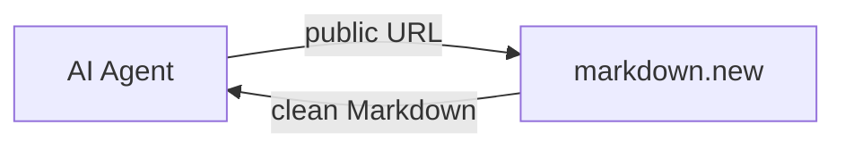
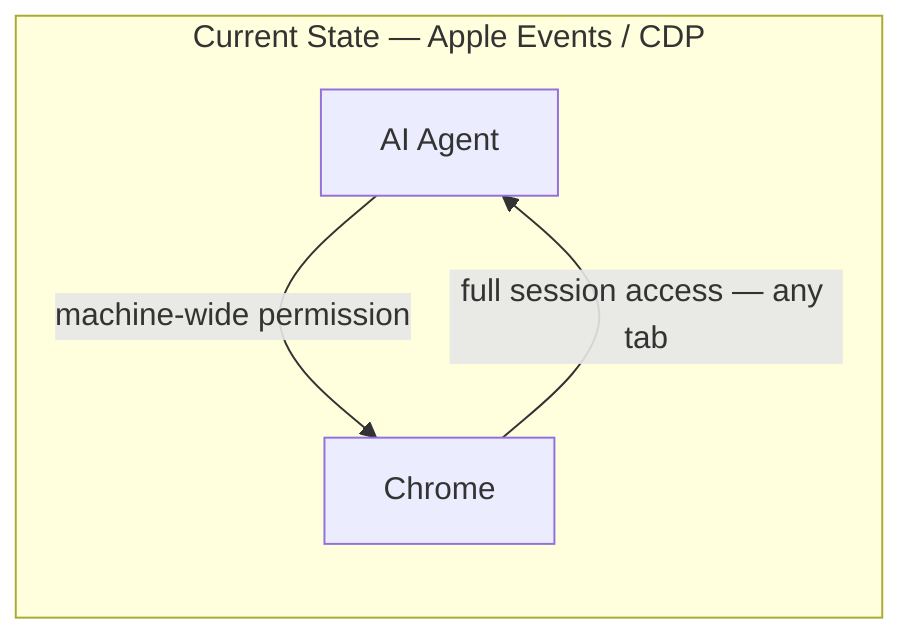
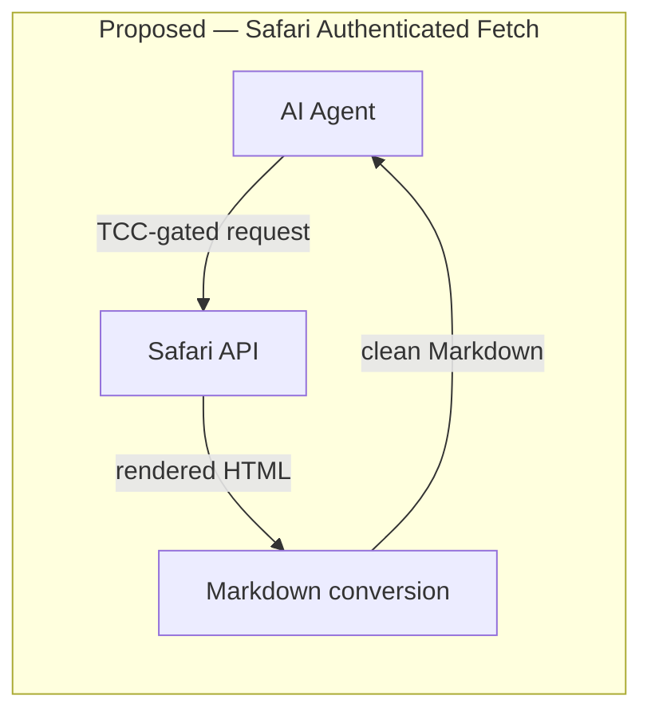

# The Authenticated Fetch Gap: An Opportunity for Apple

## The Existing Workflow — Public Web

For public web content, the developer workflow is already clean. Services like [markdown.new](https://markdown.new) accept a URL, fetch the page, and return clean Markdown — stripping navigation, ads, and markup to leave only the content. A local AI agent calls a single endpoint, receives readable text, and never needs to touch the DOM. The open-source tooling built on this pattern is at [github.com/PhenomML/cc-tools](https://github.com/PhenomML/cc-tools).

For authenticated content — paywalled journalism, institutional research, personal dashboards — no equivalent service exists. No third party can safely hold a user's credentials, so developers are filling the vacuum with mechanisms that expose far more than the content they need.

## The Problem — Authenticated Web

The dominant workaround on macOS is Apple Events. Enabling "Allow JavaScript from Apple Events" in Chrome opens a **machine-wide** surface: any process on the machine can drive the browser and act as the authenticated user in any open tab — banking sessions, email, OAuth tokens — not just the content the AI agent was trying to fetch. The permission cannot be scoped. It is a blanket capability.

**The architectural failure is the same in every workaround: the AI agent receives the ability to act as the authenticated user across every open tab, when it only needs the content of one page.**

## The Right Abstraction

Apple has already solved this class of problem in the browser context itself. `SFSafariViewController` runs in a separate Safari process that the host application cannot inspect: it cannot read cookies, inject JavaScript, or observe the session. The user's authenticated state is fully available inside that process; the host app sees only a view it cannot peek behind.

The proposed capability is the natural extension of that existing isolation: **the AI agent should receive the content, not the session.** `SFSafariViewController` already holds the content in exactly the right place. The missing API is a sanctioned way to extract the rendered text and return it to the requesting application — without the session ever crossing the process boundary.

Credential custody stays inside Safari's process and secure store. The requesting application receives rendered content — optionally converted to Markdown — with no cookie, token, or session identifier ever crossing the process boundary. The output format mirrors the public-web workflow exactly; the credential handling does not.

## Why Apple, and Why Now

Apple is the only vendor with the full stack required to make this trust model credible: the browser, the OS, the credential store, and the on-device AI all under one roof. A Google equivalent would give Google visibility into what content users are accessing. Apple's architecture makes the privacy guarantee coherent.

On iOS the opportunity is even cleaner: WebKit is already the only browser engine. Apple already holds every authenticated web session on the platform. The abstraction is architecturally present. The API is the missing piece.

The workarounds are proliferating now, as AI agents become a real product category. If Apple does not define the right abstraction, developers will standardize on the wrong one — and retrofitting safety onto an established pattern is far harder than establishing the pattern correctly from the start.
