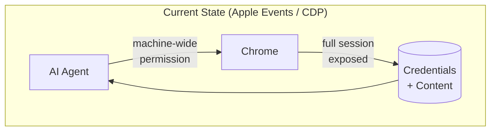
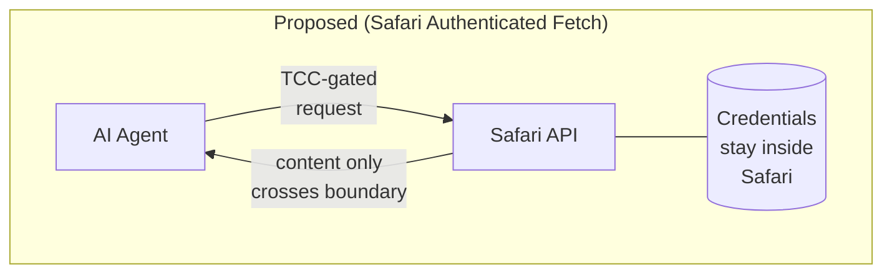

# The Authenticated Fetch Gap: An Opportunity for Apple

## The Problem

Local AI agents need to retrieve web content on behalf of users — including content behind
authentication: paywalled journalism, institutional research, personal dashboards. No safe,
sanctioned API exists for this today. Developers are filling the vacuum with mechanisms that
expose far more than the content they need.

The dominant workaround on macOS is Apple Events. Enabling "Allow JavaScript from Apple
Events" in Chrome opens a **machine-wide** surface: any process on the machine can drive
the browser and execute arbitrary JavaScript in any open tab — banking sessions, email,
OAuth tokens — not just the content the AI agent was trying to fetch. The permission cannot
be scoped. It is a blanket capability.

**The architectural failure is the same in every workaround: the AI agent receives access
to the full credential surface, when it only needs the content.**

## The Right Abstraction

Apple has already solved this class of problem. Face ID separates the biometric from the
application: the app receives a cryptographic confirmation, never the fingerprint geometry.
The same principle applies here — **the AI agent should receive the content, not the
session.**

Credential custody stays inside Safari's process and secure store. The requesting
application receives only the rendered text of the page the user authorized — no cookie,
no token, no session identifier.

## Why Apple, and Why Now

Apple is the only vendor with the full stack required to make this trust model credible:
the browser, the OS, the credential store, and the on-device AI all under one roof. A
Google equivalent would give Google visibility into what content users are accessing.
Apple's architecture makes the privacy guarantee coherent.

On iOS the opportunity is even cleaner: WebKit is already the only browser engine. Apple
already holds every authenticated web session on the platform. The abstraction is
architecturally present. The API is the missing piece.

The workarounds are proliferating now, as AI agents become a real product category. If
Apple does not define the right abstraction, developers will standardize on the wrong one —
and retrofitting safety onto an established pattern is far harder than establishing the
pattern correctly from the start.
