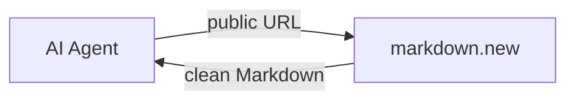
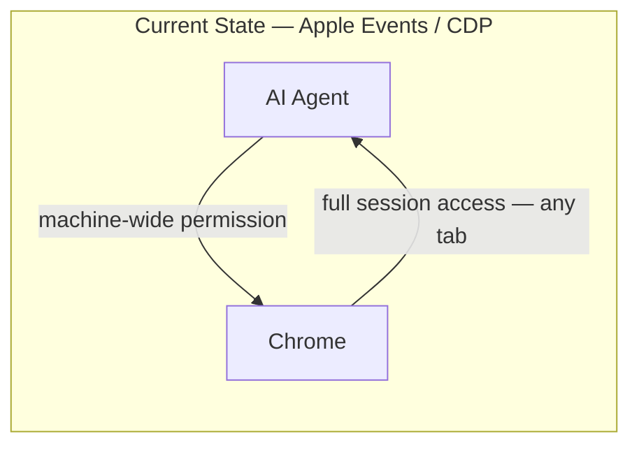
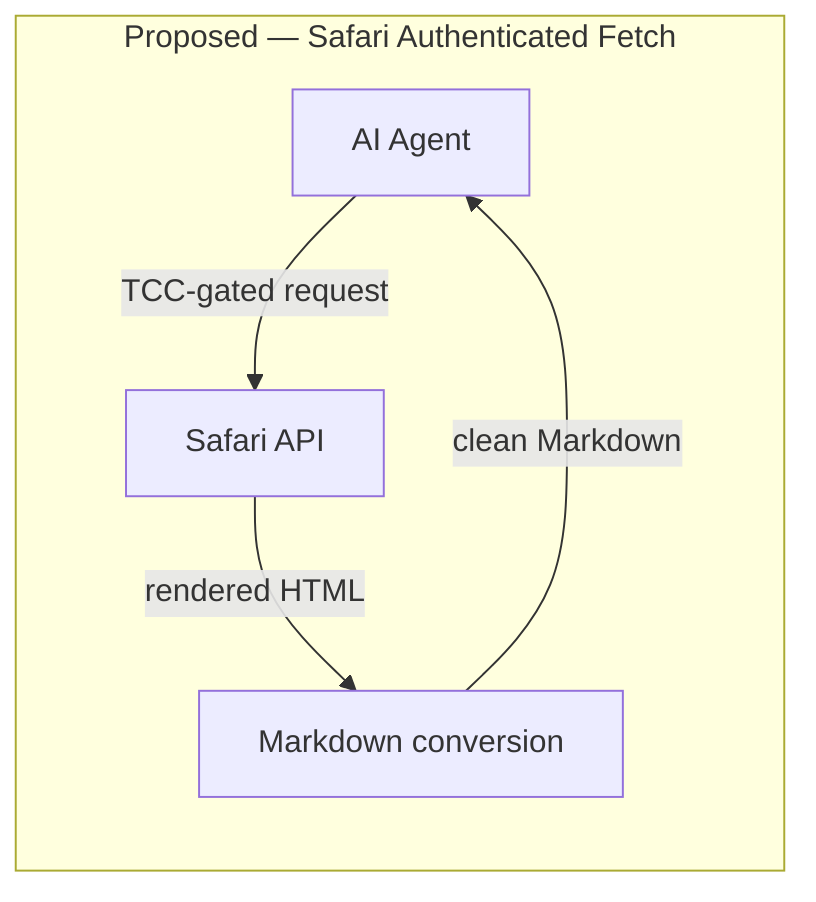

# The Authenticated Fetch Gap: An Opportunity for Apple

## The Existing Workflow — Public Web

For public web content, the developer workflow is already clean. Services like [markdown.new](https://markdown.new) accept a URL, fetch the page, and return clean Markdown — stripping navigation, ads, and markup to leave only the content. A local AI agent calls a single endpoint and receives readable text. The open-source tooling built on this pattern is at [github.com/PhenomML/cc-tools](https://github.com/PhenomML/cc-tools).

```mermaid
flowchart LR
    A[AI Agent] -->|public URL| B[markdown.new]
    B -->|clean Markdown| A
```

For authenticated content — paywalled journalism, institutional research, personal dashboards — no equivalent service exists. No third party can safely hold a user's credentials, so developers are filling the vacuum with mechanisms that expose far more than the content they need.

## The Problem — Authenticated Web

In Chrome, enabling "Allow JavaScript from Apple Events" opens a **machine-wide** surface. Any process on the machine can then drive the browser as the authenticated user in any open tab — banking sessions, email, OAuth tokens — not just the content the AI agent was trying to fetch. The permission is blanket; it cannot be scoped.

**The architectural failure is the same in every workaround: the AI agent receives the ability to act as the authenticated user across every open tab, when it only needs the content of one page.**

```mermaid
flowchart LR
    subgraph current["Current State — Apple Events / CDP"]
        A[AI Agent] -->|machine-wide permission| B[Chrome]
        B -->|full session access — any tab| A
    end
```

## Leverage the Existing Abstraction

The credential isolation piece already exists. `SFSafariViewController` runs in a separate Safari process that the host application cannot inspect: it cannot read cookies, inject JavaScript, or observe the session. The user's authenticated state is fully available inside that process; the host app sees only a view it cannot peek behind.

The content extraction piece already exists too. Reader View strips navigation, ads, and chrome from any page and returns clean readable text — the same transformation markdown.new performs for public web content — and ships in every copy of Safari, with no external service dependency and no rate limit.

**The AI agent should receive the content, not the session.** The proposed API combines what is already there: `SFSafariViewController`'s credential isolation, Reader View's content extraction, and TCC gating — the same user-consent model as microphone and camera — making the capability explicit, auditable, and revocable. The missing piece is the combination, not the technology.

```mermaid
flowchart LR
    subgraph proposed["Proposed — Safari Authenticated Fetch"]
        A2[AI Agent] -->|TCC-gated request| B2[Safari API]
        B2 -->|rendered HTML| C2[Markdown conversion]
        C2 -->|clean Markdown| A2
    end
```

Credential custody stays inside Safari's process and secure store. The requesting application receives rendered content — optionally converted to Markdown — with no cookie, token, or session identifier ever crossing the process boundary. The output format mirrors the public-web workflow exactly; the credential handling does not.

## Why Apple, and Why Now

Apple is the only vendor with the full stack required to make this trust model credible: the browser, the OS, the credential store, and the on-device AI all under one roof. A Google equivalent would give Google visibility into what content users are accessing.

On iOS the opportunity is even cleaner: WebKit is already the only browser engine. Apple already holds every authenticated web session on the platform. The abstraction is architecturally present — the API is the missing piece.

The workarounds are proliferating now, as AI agents become a real product category. Microsoft's Playwright ships as a Model Context Protocol server with first-class support in Claude Code, VS Code, Cursor, Windsurf, and most major AI coding environments. Its Browser Extension mode connects to the user's running Chrome instance and inherits every authenticated session in every open tab — banking, email, OAuth tokens, subscriber content — not just the page the AI agent requested. With 31.7K stars and growing adoption across the AI tooling ecosystem, the wrong abstraction is not approaching: it has arrived. If Apple does not define the right abstraction before this one calcifies, the opportunity to offer a safer pattern closes.
