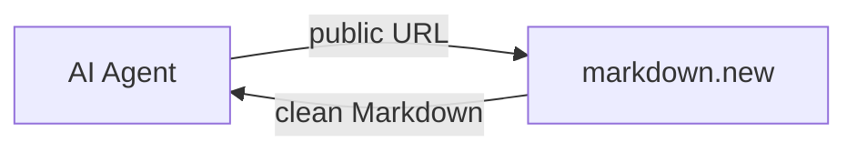
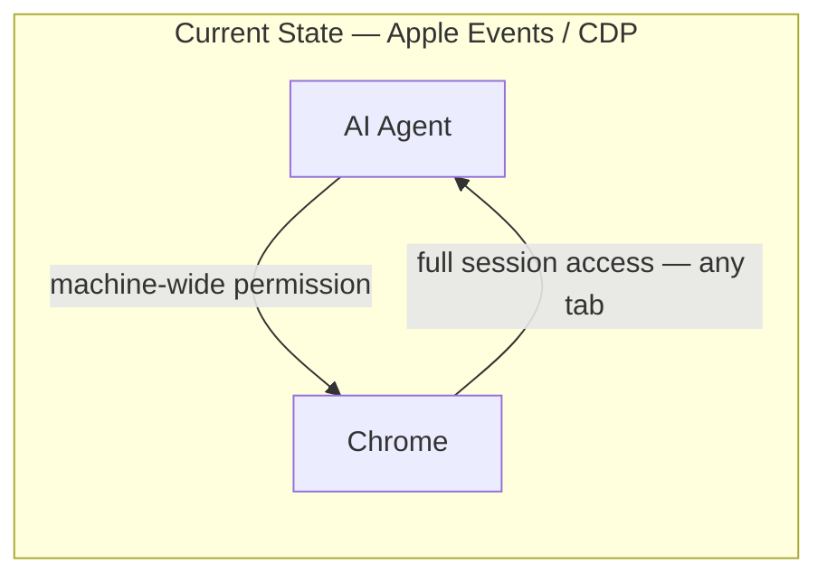
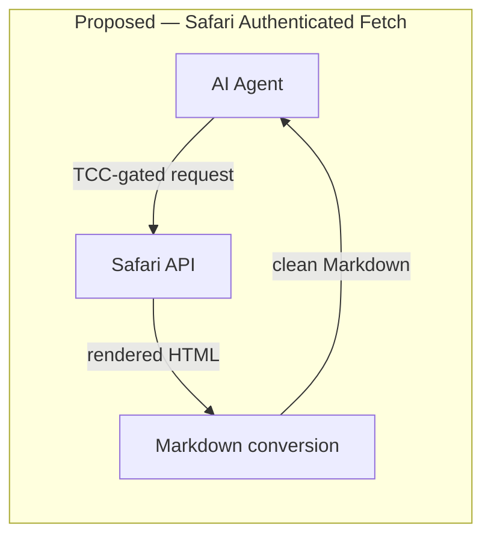

# Credentialed Content Access for Local AI Agents: A Safari API Proposal

## The Existing Workflow — Public Web

For public web content, the developer workflow is clean. Services like
[markdown.new](https://markdown.new) accept a URL, fetch the page, and return clean
Markdown — stripping navigation, ads, and markup to leave only the content. A local AI
agent calls a single endpoint, receives readable text, and never needs to touch the DOM.
Open-source tooling built on this pattern is at
[github.com/PhenomML/cc-tools](https://github.com/PhenomML/cc-tools).



For authenticated content — paywalled journalism, institutional research, personal
dashboards — no equivalent service exists. No third party can safely hold a user's
credentials, so developers are filling the vacuum with mechanisms that expose far more
than the content they need.

---

## The Problem — Authenticated Web

The dominant workaround on macOS is Apple Events. Enabling "Allow JavaScript from Apple
Events" in Chrome grants any process on the machine the ability to drive the browser and
act as the authenticated user in any open tab — banking sessions, email, OAuth tokens —
not just the content the AI agent was trying to fetch. The permission cannot be scoped to
an application, a domain, or a session. It is blanket, machine-wide session access.

Chrome's DevTools Protocol (CDP) is the other common approach: launch Chrome with
`--remote-debugging-port=9222`, connect over a local TCP port. Better scoped, but it
requires the user to close their running browser (profile lock conflict), and the port is
accessible to any process on the machine for the duration of the session.

**The structural failure is identical in every workaround: the AI agent receives the
ability to act as the authenticated user across every open tab, when it only needs the
content of one page.**



---

## The Abstraction That Is Missing

Apple has already built the right isolation — in the browser context itself.
`SFSafariViewController` runs in a separate Safari process that the host application
cannot inspect: it cannot read cookies, inject JavaScript, or observe the session. The
user's authenticated state is fully available inside that process; the host app sees only
a view it cannot peek behind. `ASWebAuthenticationSession` applies the same principle to
OAuth flows.

What does not exist is the extension of this isolation to **content extraction**: a way to
say "fetch this URL using Safari's authenticated session and return me the text, without
giving my app access to the underlying session."

`SFSafariViewController` already holds the content in exactly the right place. The missing
API is a sanctioned way to extract the rendered text and return it to the requesting
application — converting to Markdown if needed — without the session ever crossing the
process boundary.



The output format mirrors the public-web workflow exactly. The credential handling does not.

---

## Proposed API: `SAAuthenticatedFetch`

A system API scoped to applications the user has explicitly granted "Authenticated Web
Fetch" access via TCC — the same model as microphone, camera, and contacts:

```swift
import SafariServices

let request = SAAuthenticatedFetchRequest(
    url: URL(string: "https://www.stratechery.com/2026/article")!,
    extracting: .markdown          // .bodyText | .structuredData | .markdown
)

let result = try await SAAuthenticatedFetch.fetch(request)
// result.content: String — rendered page content
// result.domain: String — confirmed origin
// Credentials: never exposed to the calling application
```

**Credential isolation.** Safari fetches inside its own process using its own session
store. The requesting application receives only content — never a cookie, token, or
session identifier.

**TCC-gated, per-application.** The user grants access to specific applications in System
Settings, revocable at any time. No application can invoke the API without explicit user
consent.

**Per-domain entitlement.** The application declares which domains it may fetch. A
research tool that needs Stratechery cannot silently fetch the user's bank statement. The
OS enforces this before Safari opens a connection.

**Audit log.** Every fetch is logged — application, URL, timestamp, content size —
visible to the user in Privacy & Security settings.

**Content-only extraction.** The API returns rendered content, not raw HTTP responses.
The calling application cannot inject JavaScript, read response headers, or observe
redirects.

---

## Why Apple Is Uniquely Positioned

- **Full stack ownership.** Apple controls Safari, WebKit, iCloud Keychain, and the Secure
  Enclave. The credential isolation guarantee is only credible when one vendor controls all
  three layers. A Google equivalent would give Google visibility into what content users are
  fetching. Apple's architecture makes the privacy promise coherent.

- **On-device AI.** Apple Intelligence runs locally. A credentialed fetch that also runs
  locally — content, credentials, and inference all on the user's device — is the natural
  complement. Cloud-based AI (ChatGPT, Gemini) cannot make this promise: the content must
  leave the device to reach the model.

- **iOS/iPadOS.** WebKit is the only permitted browser engine on iOS. Apple already holds
  every authenticated web session on the platform. `SFSafariViewController` proves the
  isolation works. Content extraction is the missing piece.

- **Regulatory positioning.** The EU AI Act, GDPR, and emerging AI regulation require
  transparency and user control over personal data processed by AI systems. An OS-level
  authenticated fetch with TCC grants, per-domain entitlements, and a user-visible audit
  log is the compliance answer no cloud AI provider can match.

---

## What Happens Without This API

Apple Events will continue to be used — by developers who understand the tradeoff and by
those who do not. CDP will be the macOS default for Chrome users. Browser automation
frameworks will ship persistent-profile modes that inherit credentials informally.

AI agents will continue to access authenticated content through mechanisms that grant full
session access, with no audit trail, no user visibility, and no revocation mechanism.

Apple has the opportunity to define the correct abstraction before these workarounds
calcify into de facto standards. The moment a major AI framework ships "just use CDP" as
its credentialed fetch story, the window for a better answer narrows considerably.

---

## Implementation Path

**Phase 1 — macOS, Safari only.** The API fetches through the running Safari process using
its existing session. Content extracted via WebKit's internal rendering pipeline —
equivalent to `document.body.innerText` but without the Apple Events attack surface. No
user-visible browser interaction.

**Phase 2 — iOS/iPadOS.** Identical API; simpler implementation because WebKit is the only
engine. The on-device AI use case is strongest here: Apple Intelligence summarizing
subscriber content, Siri pulling authenticated dashboards into Shortcuts workflows.

**Phase 3 — Passkeys.** Extend credential sources beyond Safari session cookies to
passkey-authenticated sites. As passkeys displace passwords, the API's reach grows
automatically.

**Entitlement model.** Like `com.apple.developer.networking.networkextension`, authenticated
fetch requires a provisioning entitlement — ensuring only reviewed applications can request
it, and providing a platform-level revocation mechanism.

---

## Summary

The gap is real, the workarounds are dangerous, and Apple is the only vendor with the
architectural position to close it properly. `SFSafariViewController` already demonstrates
the isolation model. `SAAuthenticatedFetch` extends it by one step — returning content
instead of rendering a view — and in doing so gives local AI agents the same clean,
credential-safe workflow that `markdown.new` provides for the public web.
